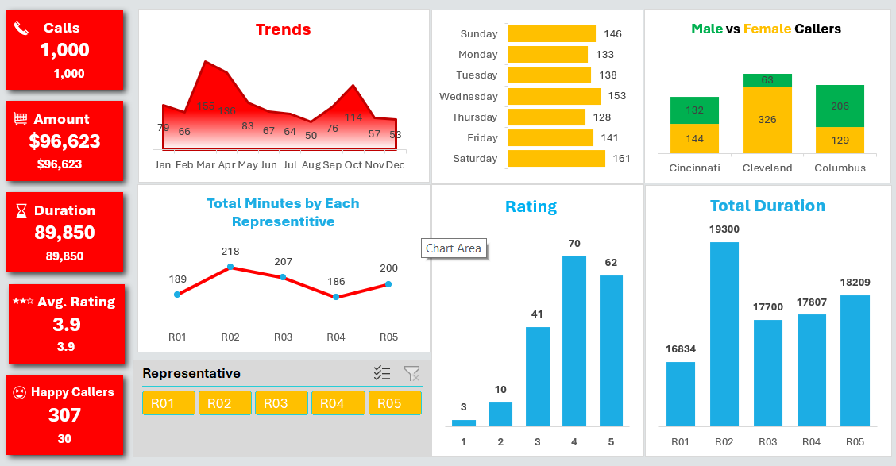

# Business Dashboards (Excel)

This folder contains professional Excel dashboards built from real-world style datasets.  
Each dashboard is designed to provide **business insights, track KPIs, and support decision-making**.  

---

## 📊 Projects

### 1. Call Center Performance Dashboard
- Tools: Excel (Pivot Tables, Charts, Advanced Formulas)
- Highlights:
  - Monitored call volumes, resolution times, and agent performance.
  - Built KPIs for Average Handling Time (AHT) and First Call Resolution (FCR).
  - Interactive filters for time periods and agents.
- [Download Excel File](./Call%20Center%20Performance%20Dashboard.xlsx)  

*Screenshot:*  

---

### 2. Superstore Sales Performance Dashboard
- Tools: Excel (Power Query, Data Modeling, Advanced Charts)
- Highlights:
  - Analyzed sales trends across categories and regions.
  - Built KPIs for profit margins, top-performing products, and repeat customers.
  - Designed a clean dashboard layout for management reporting.
- [Download Excel File](./Superstore%20Sales%20Performance%20Dashboard.xlsx)  

*Screenshot:*  

